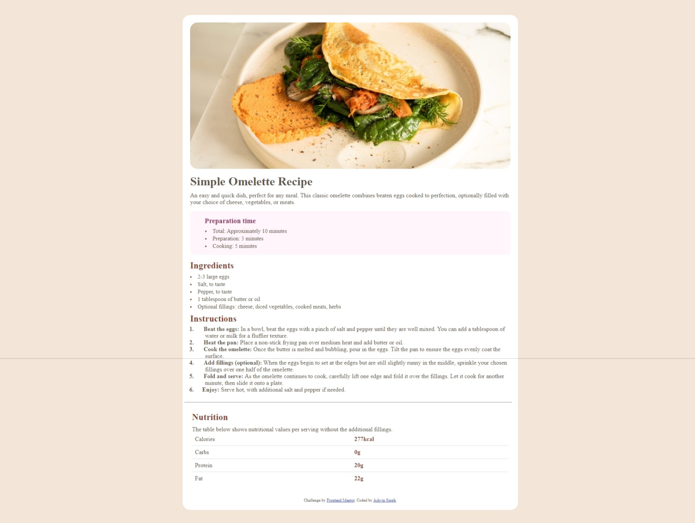

# Frontend Mentor - Recipe page solution

This is a solution to the [Recipe page challenge on Frontend Mentor](https://www.frontendmentor.io/challenges/recipe-page-KiTsR8QQKm). Frontend Mentor challenges help you improve your coding skills by building realistic projects. 

## Table of contents

- [Frontend Mentor - Recipe page solution](#frontend-mentor---recipe-page-solution)
  - [Table of contents](#table-of-contents)
  - [Overview](#overview)
    - [Screenshot](#screenshot)
    - [Links](#links)
  - [My process](#my-process)
    - [Built with](#built-with)
    - [What I learned](#what-i-learned)
    - [Continued development](#continued-development)
    - [Useful resources](#useful-resources)
  - [Author](#author)
  - [Acknowledgments](#acknowledgments)

**Note: Delete this note and update the table of contents based on what sections you keep.**

## Overview

### Screenshot




### Links

- Solution URL: [Recipe Page](https://www.frontendmentor.io/solutions/recipe-page--_hORjmEki)
- Live Site URL: [Recipe Page URL](https://ashvin-to.github.io/Recipe-page/)

## My process

### Built with

- Semantic HTML5 markup
- CSS custom properties
- Flexbox
- CSS Grid
- Mobile-first workflow


### What I learned

Use this section to recap over some of your major learnings while working through this project. Writing these out and providing code samples of areas you want to highlight is a great way to reinforce your own knowledge.

To see how you can add code snippets, see below:

```html
<table>
      
        <tr>
            <td>Calories</td>
            <td><b>277kcal</b></td>
        </tr>
        <tr>
            <td>Carbs</td>
            <td><b>0g</b></td>
        </tr>
        <tr>
            <td>Protein</td>
            <td><b>20g</b></td>
        </tr>
        <tr>
            <td>Fat</td>
            <td><b>22g</b></td>
        </tr>
    </table>
```
```html
<div class="attribution">
      Challenge by
      <a href="https://www.frontendmentor.io?ref=challenge" target="_blank"
        >Frontend Mentor</a
      >. Coded by
      <a href="https://github.com/ashvin-to" target="_blank">Ashvin Singh</a>.
    </div>
```
```css
.time{
    content: " ";
    padding: 15px;
    margin-top: 15px;
    padding-left: 40px;
    width: auto;
    height: auto;
    border-radius: 10px;
    background-color: hsl(330, 100%, 98%);
}
```


### Continued development

I would like to continue learning about accessibility and responsive design in order to make my website more user friendly for all users. Additionally, I want focus on learning javascript and go deep in it. I have to even understand the few concepts of CSS would really love to go much deeper into it. Leanrning and exploring tailwind will gonna be a fun part.
I had problem while making this project, I didn't know about how to make it  responsive and adaptable for different screen sizes. So it took me some time to learn. 


### Useful resources

- [Javatpoint](https://www.javatpoint.com) - This helped me for to learn the few propeties of CSS. I really liked there way of explaining things it helped me to clear my hidden doubts which was earlier trapped in my mind.
- [MDN Web Docs](https://developer.mozilla.org/en-US/) - A comprehensive guide to web development.
- [w3schools](https://www.w3schools.com/) - Another great resource for learning web development.


## Author

- Website - [Ashvin Singh](https://github.com/ashvin-to)
- Frontend Mentor - [@ashvin-to](https://www.frontendmentor.io/profile/ashvin-to)
- Twitter - [@AshvinSingh75975](https://[www.twitter.com/AshvinSing75975])


## Acknowledgments

Thanks to everyone who who helped me to complete this project. And a special thank you to the resouuces and the makers of those resourceful sites. 


